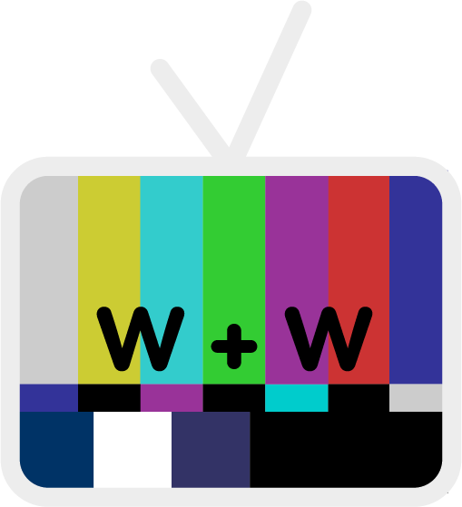

# What To Watch  

What to Watch is a webstite that links with streaming websites to be a one-stop search bar so that you can know which services offer which movies and tv shows.

## Developers
* Product Owner/Scrum Master: Christian Hodges, [chodges7](https://github.com/chodges7)
* Past Developer: Lukas Pecson, [lpecson](https://github.com/lpecson)
* Past Developer: Vidit Dhaka, [vdhaka](https://github.com/vdhaka)

## Dependancies that this project uses need:
* Django
* Docker
* see requirements.txt and shrinkwrap.json in front_end app
